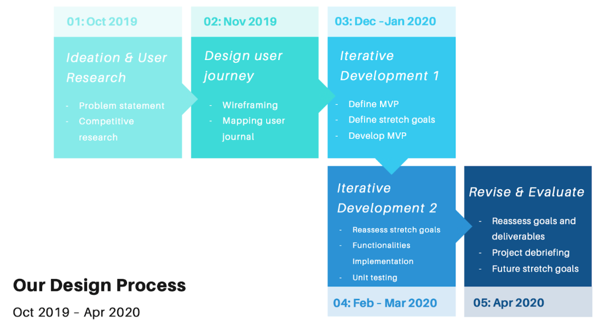
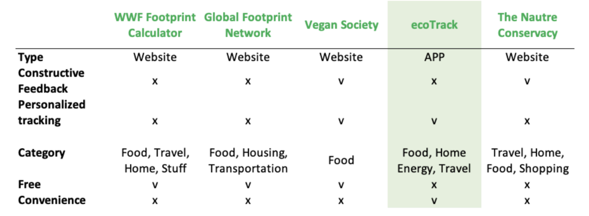
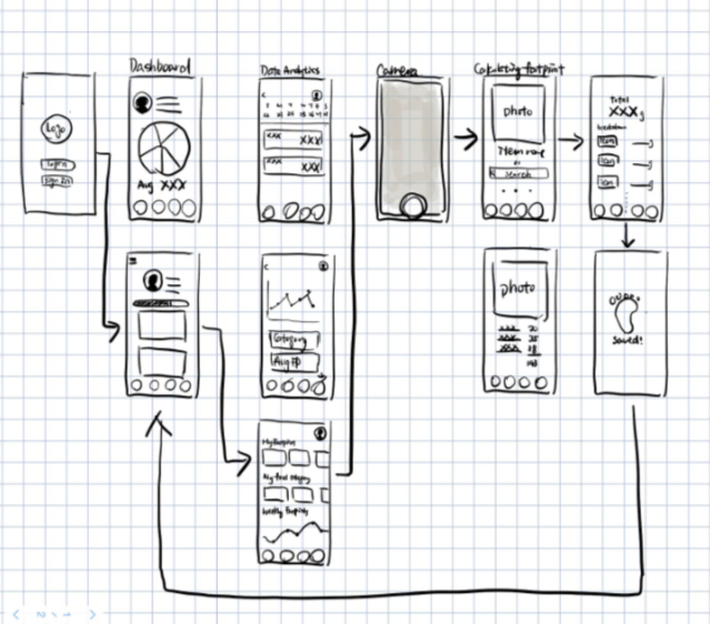
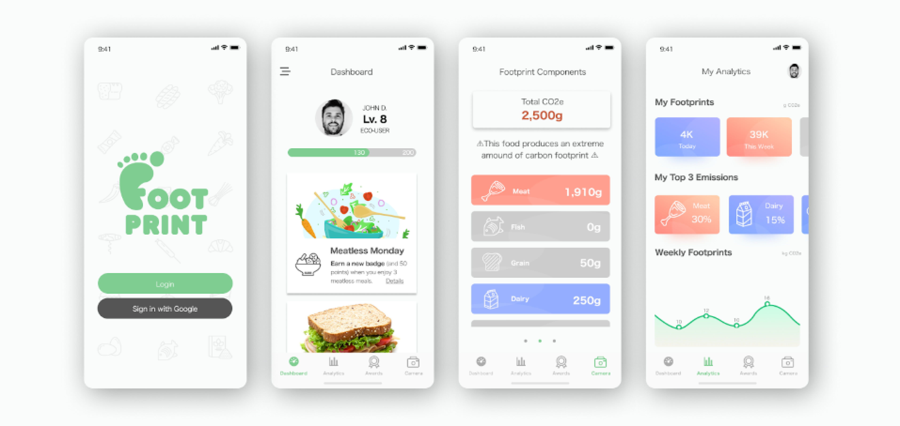
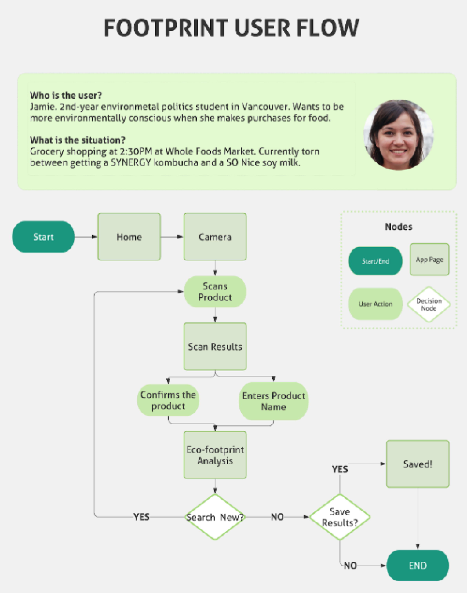
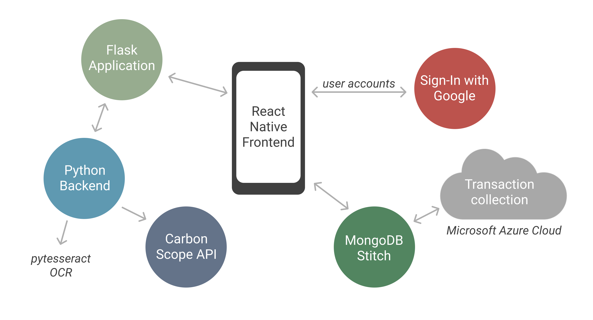

# Footprint

Footprint is a React Native application that enables users to scan food items using computer vision and obtain the corresponding ecological footprint of the product.

#### Timeframe
8 months (October 2019 - April 2020)

#### Skills
- UX/UI
- Competitive Analysis
- Front-end & Back-end development
- Data visualization
- Project management

## 🌳 Background and Motivation
We hope that Footprint will empower individuals to make environmentally informed decisions about the food they consume. Our food system contributes over 25% of total greenhouse gas emissions and 80% of global deforestation. So naturally, eating a more ecologically-conscious diet is one of the best ways to reduce your carbon footprint. However, specific and accurate information about how to eat an ecologically-conscious diet is difficult to find. Additionally, we understand that it can be difficult for one to change their habits. Therefore, we decided to create a tool that not only will be able to assist users’ decision making by providing information on users’ ecological footprint with respect to their food choices, but also will be able to track their progress and make their efforts visible. Footprint aims to provide detailed and accurate information about food items, while still maintaining a friendly and easy-to-use interface.

## :question: Problem Definition and Solution
There are many approaches for us to become more sustainable, and most of the people are aware of them. However, what is stopping people from taking action?

To provide a focused solution, instead of focusing on general footprint from multiple categories, we decided to focus on the most impactful one -- Food consumption, as a number of studies have outlined the shift from a meat-heavy to a plant-based diet could reduce individuals’ food-related carbon emission by one-third or more.

## :writing_hand: Design Process
Throughout the past 8 months, our team has divided up our design and development process into the following stages:

## :pencil: Ideation and Prototyping
To create an APP that can be used to help to make informed decisions on food choices, we have conducted a competitive analysis to define the key areas of the problem we want to address.

#### Competitive Analysis
We have researched the top-ranked carbon footprint tracking tools and filter down to the ones that include food consumption measurement.

From the analysis, we realized that most of the existing tools are hosted on websites, which focuses on raising awareness from individuals, rather than helping users to change their behaviors. 

Therefore, we concluded the key areas of the problem we want to address:
- Lack of understanding of their own food consumption footprint 
- Don’t know how to make a change and set goals for themselves
- Lack of motivation to change their behaviors

We have also explored how the competitors utilize UX/UI to address the problems. Some apps had decent features and basic elements of gamification; however, most of them were not intuitive and did not seem to engage users. More importantly, the information was not curated and did not support food-related carbon footprint analytics, such as tracking and saving carbon footprints after having a meal. Based on our research, we focused on creating UX which:
- Is intuitive and provides a seamless experience when it comes to tracking carbon footprint after each meal or snack  
- Curates and customizes data for each user  
- Is engaging and provides users an incentive to pursue a more plant-based diet

#### Wireframing

## Our Proposition and Final Design
#### Overview
Footprint, an app dedicated to assisting individuals in reducing their food consumption ecological footprint, will encourage behavioral change and a more sustainable lifestyle by providing personalized information for users to make the optimal decision. Instead of focusing on creating awareness, Footprint is a personalized tool for users to take action in saving the planet.

#### Product Specifications
- Displays data about how they are purchasing to allow them to understand their footprint
- Provides the motivation to make the change 
- Providing concrete goals, suggestions, etc for users to make changes

#### MVP Outline
- Scanning receipts
- Calculating breakdown of people's footprint on that receipt
- Tracking and displaying their trends over time
- Provide suggestions on how to improve
- Provide goals
- Implement a point system with rewards for improvement 

#### Final Design

#### User Flow

## :computer: Development
#### Overview
Footprint is built with a React Native frontend and a Flask-based Python backend.

| Feature | Technology |
|---------|------------|
| Authentication | Google Sign-In |
| User info storage | MongoDB Stitch |
| Computer vision | pytesseract |
| Carbon footprint data | CleanMetrics CarbonScope API |

#### Frontend
#### *Figma*
We used Figma which is a free browser-based collaboration tool for UX designers. Aside from cost savings, using Figma to create a wireframe and prototype allowed us to collaboratively review the design, leave comments, and make updates or edits.  

#### *React Native*
We chose to build our app using React Native because it is easy to deploy to both Android and iOS, and it does not require any special development tools beyond npm and a text editor. We also chose to work with Expo CLI because it is a great tool to get started with. Expo CLI makes accessing native components such as the camera simple and easy. While it does not provide quite as many opportunities to fine-tune configurations and add native code as the React Native CLI does, we found it worked well for our purposes, and it streamlined our development process.

#### Backend
#### *Google Sign-In*
We decided to use Google Sign-In for authentication to prevent our users from needing to create a separate account. Google Sign-In is more convenient for users, and it also gives users the reassurance that their personal data is being handled securely. In addition, this decision  streamlined the authentication process for our team, since we didn’t need to store passwords or implement features such as password recovery. 

#### *MongoDB Stitch*
MongoDB Stitch provides a Backend as a Service, which helped us to get up and running quickly, and without worrying about hosting our own database backend. We created a transaction collection, where each transaction contained what product was purchased, the user id that purchased a product, when the product was purchased, and the product’s carbon footprint breakdown. We were able to use a React Native library to easily create a database client that our React Native frontend could use to access the database.

#### *Pytesseract*
To make our app easier to use, we decided to incorporate Optical Character Recognition (OCR) to scan the ingredients list of products so that our users would not have to enter them manually. We decided to use Pytesseract, an Optical Character Recognition (OCR) library for python, for this purpose. We hosted a Python app that incorporated this library on Flask, which enabled us to connect this functionality to our React Native frontend.

#### *CleanMetrics CarbonScope API*
One of the core features of our application is its ability to provide comprehensive and accurate data about the carbon footprint of various food items. We considered a number of approaches to this feature including finding the carbon footprint of food items ourselves, working with Food Systems faculty at UBC, and reaching out to third party providers. In the end, we decided that the best approach would be to reach out to third party providers because of our timeline and skillset. We chose to work with the CleanMetrics CarbonScope API because it provided the carbon footprint for a wide array of different food products, and these carbon footprint values were calculated using comprehensive life cycle analyses.

## :mountain_snow: Challenges we Faced
On the development side of things, one of the main challenges we face was many of us having never used React Native before, as well as having only some experience with JavaScript, which was a result of us wanting to learn more and push ourselves. Additionally, working with SVG elements was a challenge to add text and icons due to how libraries and SVG work. Layering elements was a challenge.

Regarding design, picking colors for the UI and creating color palettes for the brand was a struggle. In addition to choosing aesthetically pleasing colors, I had to consider what colors would better encapsulate the brand Footprint has.

## :raising_hand: Contributing
Footprint is an opensource project maintained by UBC Launch Pad. Any contributions, including pull requests, bug fixes, feedback, and ideas, are more than welcome!

#### Our Team
| Name | Role | Key Contributions |
|------|------|-------------------|
| Sarah Bornais | Tech Lead | Project management, React Native frontend, database, CarbonScope API integration |
| Achinth Bharadwaj | Developer | Data visualization |
| Odin Mebesius | Developer | In-app user authentication, styling, naviagation |
| Jenny Kim | Designer | UX research, UI design |
| Rene Huang | Strategist | Competitive anaylsis, product management |
